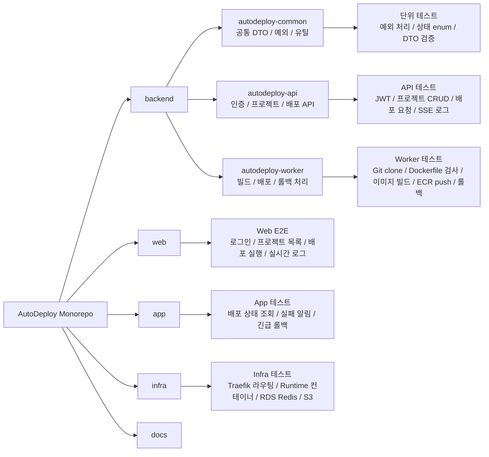
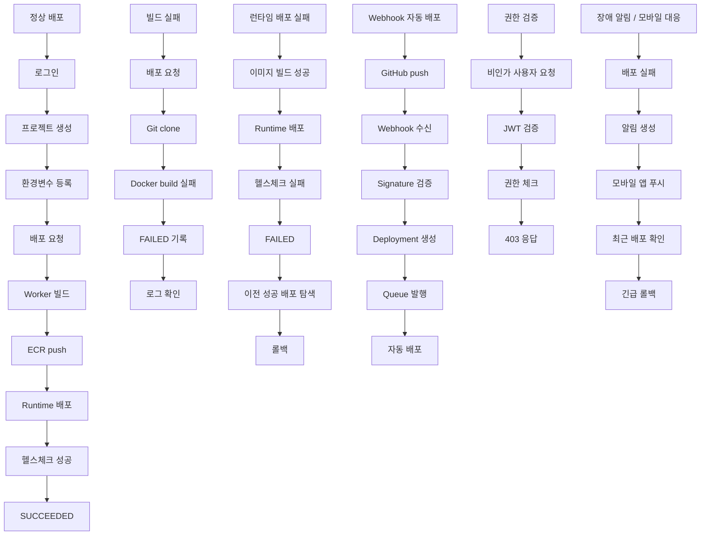
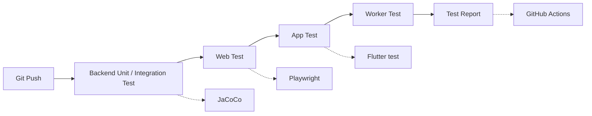

# AutoDeploy 개발 가이드 및 테스트 시나리오

> GitHub 저장소를 등록하면 Dockerfile 기반으로 빌드하고, AWS EC2 Runtime Server에 자동 배포하며, 로그·헬스체크·롤백을 제공하는 배포 자동화 플랫폼.

---

## 1. 프로젝트 개요

**AutoDeploy**는 개발자가 GitHub 저장소를 연결한 뒤 버튼 클릭 또는 Webhook 이벤트를 통해 서비스를 자동으로 배포할 수 있게 해주는 플랫폼이다.

핵심 흐름은 다음과 같다.

```text
GitHub 저장소 연결
→ 배포 요청 생성
→ Git clone
→ Docker build
→ 이미지 저장소 push
→ 운영 서버 pull
→ 컨테이너 실행
→ Reverse Proxy 연결
→ Health Check
→ 성공/실패 기록
→ 로그 제공
→ 실패 시 Rollback
```

---

## 2. 권장 기술 스택

```text
Backend: Spring Boot 3.x + Java 21
Web: Vue 3 + TypeScript
Mobile App: Flutter
DB: PostgreSQL
Cache / Lock: Redis
Queue: RabbitMQ 또는 Amazon SQS
Build: Docker + BuildKit
Runtime: AWS EC2 + Docker Compose
Reverse Proxy: Traefik
Registry: Amazon ECR
Storage: S3
DNS: Route 53
Monitoring: CloudWatch + Prometheus + Grafana + Loki
```

---

## 3. 핵심 도메인 지식

### 3.1 CI/CD

AutoDeploy는 CI와 CD를 모두 다룬다.

```text
CI 영역
- Git clone
- Commit checkout
- Dockerfile 검사
- Docker build
- Image tag 생성
- Registry push

CD 영역
- Runtime server 접속
- Image pull
- Container 실행
- Traefik 라우팅
- Health check
- Rollback
```

### 3.2 GitHub 연동

MVP에서는 GitHub public repository만 지원해도 충분하다.

1차 기능:

```text
- Repository URL 등록
- Branch 입력
- 최신 commit 조회
- 특정 commit 기준 배포
- 수동 배포
```

확장 기능:

```text
- GitHub OAuth
- Private repository 접근
- Repository 목록 조회
- Push webhook 수신
- PR preview deployment
```

Webhook 자동 배포 흐름:

```text
GitHub push
→ Webhook 수신
→ Signature 검증
→ Branch 확인
→ Deployment 생성
→ Queue 발행
→ Worker 자동 배포
```

### 3.3 Docker / Container

MVP에서는 사용자 프로젝트가 반드시 `Dockerfile`을 포함해야 한다.

```text
사용자 GitHub 저장소 clone
→ Dockerfile 확인
→ Docker build
→ Image tag 생성
→ ECR push
→ Runtime server에서 pull
```

이미지 태그 전략:

```text
autodeploy-runtime:project-12-deploy-101
autodeploy-runtime:project-12-commit-a1b2c3d
```

`latest`만 쓰면 롤백이 어려우므로 배포 ID 또는 commit hash 기반 태그를 사용한다.

### 3.4 Registry

AWS를 사용한다면 Amazon ECR을 추천한다.

```text
Build Worker
→ Docker image build
→ ECR push

Runtime Server
→ ECR pull
→ Container run
```

MVP에서는 하나의 ECR repository에 project/deployment 단위 tag로 구분하는 구조가 단순하다.

### 3.5 Reverse Proxy / Routing

사용자 앱마다 서브도메인을 연결한다.

```text
api.autodeploy.dev          → AutoDeploy API
dashboard.autodeploy.dev    → AutoDeploy Web
project-12.autodeploy.dev   → 사용자 앱 12
project-13.autodeploy.dev   → 사용자 앱 13
```

Traefik label 예시:

```yaml
labels:
  - "traefik.enable=true"
  - "traefik.http.routers.project-12.rule=Host(`project-12.autodeploy.dev`)"
  - "traefik.http.services.project-12.loadbalancer.server.port=8080"
```

### 3.6 Deployment 상태머신

배포 도메인의 핵심은 상태 전이 관리다.

```text
PENDING
QUEUED
CLONING
CHECKING_DOCKERFILE
BUILDING
PUSHING_IMAGE
DEPLOYING
HEALTH_CHECKING
SUCCEEDED
FAILED
CANCELED
ROLLING_BACK
ROLLED_BACK
ROLLBACK_FAILED
```

정상 흐름:

```text
PENDING
→ QUEUED
→ CLONING
→ CHECKING_DOCKERFILE
→ BUILDING
→ PUSHING_IMAGE
→ DEPLOYING
→ HEALTH_CHECKING
→ SUCCEEDED
```

실패 흐름:

```text
CLONING → FAILED
BUILDING → FAILED
DEPLOYING → FAILED
HEALTH_CHECKING → FAILED
```

롤백 흐름:

```text
FAILED 또는 SUCCEEDED
→ ROLLING_BACK
→ ROLLED_BACK
```

### 3.7 Health Check

컨테이너가 실행되었다고 배포 성공으로 보지 않는다.  
지정한 health check path가 정상 응답해야 성공이다.

```text
healthCheckPath: /health
healthCheckMethod: GET
healthCheckExpectedStatus: 200
healthCheckTimeoutSeconds: 60
healthCheckIntervalSeconds: 5
```

성공 조건:

```text
컨테이너 실행
→ 5초마다 /health 호출
→ 60초 안에 200 응답
→ 배포 성공
```

### 3.8 Rollback

MVP 롤백은 이전 성공 배포 이미지로 되돌리는 방식으로 충분하다.

```text
현재 배포: deploy-103
이전 성공 배포: deploy-102

Rollback 요청
→ deploy-102 이미지 pull
→ 기존 컨테이너 중지
→ deploy-102 컨테이너 실행
→ Health check
→ 성공 시 ROLLED_BACK
```

MVP 제한:

```text
- Stateless HTTP service만 지원
- DB migration rollback 제외
- Volume 있는 서비스 제외
```

### 3.9 로그

로그 종류:

```text
Build Log
Deploy Log
Runtime Log
Webhook Log
System Log
Audit Log
```

MVP에서는 Build/Deploy Log에 집중한다.

추천 저장 전략:

```text
최근 로그: PostgreSQL 또는 Redis
장기 로그: S3
검색 로그: Loki
```

실시간 로그는 SSE를 추천한다.

```http
GET /api/deployments/{deploymentId}/logs/stream
```

### 3.10 Queue / Worker

배포는 오래 걸리는 작업이므로 API 서버에서 직접 처리하지 않는다.

```text
POST /deploy
→ Deployment 생성
→ Queue에 Job 발행
→ deploymentId 반환
→ Worker가 비동기 처리
```

Job 예시:

```json
{
  "jobType": "DEPLOYMENT_REQUESTED",
  "deploymentId": 101,
  "projectId": 12,
  "branch": "main",
  "commitHash": "a1b2c3d"
}
```

### 3.11 보안

최소 보안 기준:

```text
- 사용자 코드를 API 서버에서 직접 실행하지 않기
- Build Worker와 API Server 분리
- Runtime Server 분리
- 환경변수 암호화 저장
- GitHub token 암호화 저장
- 로그에 secret 노출 방지
- Webhook signature 검증
- 배포 권한 체크
- 프로젝트별 배포 lock
- Container resource limit
- Build timeout
- Runtime timeout
```

Secret masking 대상:

```text
GITHUB_TOKEN
DATABASE_URL
JWT_SECRET
AWS_SECRET_ACCESS_KEY
```

---

## 4. 전체 아키텍처

```text
[Web Dashboard - Vue]
[Mobile App - Flutter]
        |
        v
[Spring Boot API Server]
        |
        +-- PostgreSQL
        +-- Redis
        +-- RabbitMQ or SQS
        +-- S3
        |
        v
[Build Worker]
        |
        +-- Git clone
        +-- Docker BuildKit
        +-- ECR push
        |
        v
[Deploy Worker]
        |
        +-- Runtime EC2 제어
        +-- ECR pull
        +-- Docker container run
        +-- Traefik label 설정
        +-- Health check
        |
        v
[Runtime EC2]
        |
        +-- Traefik
        +-- User app containers
```

---

## 5. AWS 구성

### MVP 추천 구성

```text
EC2 #1 - Platform Server
- Spring Boot API
- Build Worker
- Deploy Worker
- RabbitMQ
- Redis

EC2 #2 - Runtime Server
- Docker
- Traefik
- 사용자 앱 컨테이너

RDS PostgreSQL
ECR
S3
Route 53
CloudWatch
```

### 비용 절약형 구성

```text
EC2 1대
- API
- Worker
- Redis
- RabbitMQ
- PostgreSQL
- Traefik
- 사용자 앱
```

개발/시연용으로만 추천한다.

---

## 6. 프로젝트 구조

```text
AutoDeploy/
  backend/
    settings.gradle
    build.gradle
    autodeploy-common/
    autodeploy-api/
    autodeploy-worker/

  web/
    package.json
    src/

  app/
    pubspec.yaml
    lib/

  infra/
    docker/
    aws/
    scripts/

  docs/
    architecture.md
    deployment-flow.md
    api-spec.md
    database-schema.md
    security.md
    troubleshooting.md

  README.md
```

---

## 7. Backend 구조

### Gradle 멀티모듈

```text
autodeploy-backend/
  settings.gradle
  build.gradle

  autodeploy-common/
    build.gradle
    src/main/java/com/autodeploy/common/
      config/
      error/
      security/
      util/
      event/
      dto/

  autodeploy-api/
    build.gradle
    src/main/java/com/autodeploy/api/
      AutoDeployApiApplication.java

  autodeploy-worker/
    build.gradle
    src/main/java/com/autodeploy/worker/
      AutoDeployWorkerApplication.java
```

### 모듈 역할

| 모듈 | 역할 |
|---|---|
| autodeploy-common | 공통 DTO, 예외, 유틸, 이벤트 메시지 |
| autodeploy-api | REST API, 인증, 프로젝트, 배포 요청 |
| autodeploy-worker | Git clone, Docker build, ECR push, runtime deploy, rollback |

### API 패키지 예시

```text
com.autodeploy.api
  auth/
  user/
  project/
  repository/
  deployment/
  environment/
  webhook/
  runtime/
  log/
  notification/
  audit/
  global/
```

### Worker 패키지 예시

```text
com.autodeploy.worker
  job/
  build/
  deploy/
  docker/
  aws/
  log/
  runtime/
  config/
```

---

## 8. 주요 도메인 모델

### User

```java
@Entity
public class User {
    @Id
    private Long id;

    private String email;
    private String passwordHash;
    private String name;

    @Enumerated(EnumType.STRING)
    private UserStatus status;

    private LocalDateTime createdAt;
}
```

### Project

```java
@Entity
public class Project {
    @Id
    private Long id;

    private Long ownerId;

    private String name;
    private String description;

    private String repositoryUrl;
    private String defaultBranch;
    private String rootDirectory;

    @Enumerated(EnumType.STRING)
    private BuildType buildType;

    private String healthCheckPath;
    private Integer healthCheckPort;

    @Enumerated(EnumType.STRING)
    private ProjectStatus status;

    private LocalDateTime createdAt;
}
```

### EnvironmentVariable

```java
@Entity
public class EnvironmentVariable {
    @Id
    private Long id;

    private Long projectId;
    private String key;

    // 암호화 저장
    private String encryptedValue;

    private Boolean secret;
    private LocalDateTime createdAt;
}
```

### Deployment

```java
@Entity
public class Deployment {
    @Id
    private Long id;

    private Long projectId;

    private String branch;
    private String commitHash;
    private String commitMessage;

    private String imageRepository;
    private String imageTag;

    @Enumerated(EnumType.STRING)
    private DeploymentStatus status;

    @Enumerated(EnumType.STRING)
    private DeploymentTriggerType triggerType;

    private Long previousDeploymentId;

    private LocalDateTime startedAt;
    private LocalDateTime finishedAt;

    private String failureReason;
}
```

### DeploymentLog

```java
@Entity
public class DeploymentLog {
    @Id
    private Long id;

    private Long deploymentId;
    private Long sequence;

    @Enumerated(EnumType.STRING)
    private LogLevel level;

    @Column(columnDefinition = "TEXT")
    private String message;

    private LocalDateTime createdAt;
}
```

### RuntimeInstance

```java
@Entity
public class RuntimeInstance {
    @Id
    private Long id;

    private Long projectId;
    private Long deploymentId;

    private String containerName;
    private String imageTag;

    private String subdomain;
    private Integer internalPort;

    @Enumerated(EnumType.STRING)
    private RuntimeStatus status;

    private LocalDateTime startedAt;
}
```

---

## 9. API 설계

### Auth

```http
POST /api/auth/signup
POST /api/auth/login
POST /api/auth/refresh
POST /api/auth/logout
```

### Project

```http
POST   /api/projects
GET    /api/projects
GET    /api/projects/{projectId}
PATCH  /api/projects/{projectId}
DELETE /api/projects/{projectId}
```

### Environment Variable

```http
POST   /api/projects/{projectId}/env
GET    /api/projects/{projectId}/env
PATCH  /api/projects/{projectId}/env/{envId}
DELETE /api/projects/{projectId}/env/{envId}
```

### Deployment

```http
POST /api/projects/{projectId}/deployments
GET  /api/projects/{projectId}/deployments
GET  /api/deployments/{deploymentId}
POST /api/deployments/{deploymentId}/cancel
POST /api/deployments/{deploymentId}/rollback
GET  /api/deployments/{deploymentId}/logs
GET  /api/deployments/{deploymentId}/logs/stream
```

### Runtime

```http
GET /api/projects/{projectId}/runtime
GET /api/projects/{projectId}/runtime/status
GET /api/projects/{projectId}/runtime/logs
```

### Webhook

```http
POST /api/webhooks/github
```

---

## 10. Worker 처리 흐름

```text
1. 사용자 배포 버튼 클릭
2. API Server가 Deployment 생성
3. 상태 PENDING
4. 프로젝트별 deploy lock 확인
5. 상태 QUEUED
6. Queue에 DeploymentRequested 메시지 발행
7. Worker가 메시지 소비
8. Git clone
9. Dockerfile 검사
10. Docker build
11. ECR push
12. Runtime Server에 배포 명령
13. Container 실행
14. Health check
15. SUCCEEDED 또는 FAILED 저장
16. Lock 해제
```

의사코드:

```java
public void handle(DeploymentRequestedMessage message) {
    Long deploymentId = message.deploymentId();

    try {
        deploymentStateService.markCloning(deploymentId);
        Path workspace = gitCloneService.cloneRepository(message);

        deploymentStateService.markCheckingDockerfile(deploymentId);
        dockerfileValidator.validate(workspace);

        deploymentStateService.markBuilding(deploymentId);
        DockerImage image = dockerBuildService.build(workspace, message);

        deploymentStateService.markPushingImage(deploymentId);
        imagePushService.push(image);

        deploymentStateService.markDeploying(deploymentId);
        runtimeDeployService.deploy(image, message);

        deploymentStateService.markHealthChecking(deploymentId);
        healthCheckService.check(message.projectId());

        deploymentStateService.markSucceeded(deploymentId);
    } catch (Exception e) {
        deploymentStateService.markFailed(deploymentId, e.getMessage());
        logAppender.error(deploymentId, e.getMessage());
    } finally {
        workspaceService.cleanup(deploymentId);
        deployLockService.unlock(message.projectId());
    }
}
```

---

## 11. 테스트 시나리오 다이어그램

### 11.1 프로젝트 구조 중심 테스트 맵



### 11.2 핵심 E2E 테스트 흐름



---

## 12. 테스트 계층

| 계층 | 대상 | 도구 |
|---|---|---|
| 단위 테스트 | 도메인 로직, 상태머신, 유틸 | JUnit 5 |
| 통합 테스트 | DB, Redis, RabbitMQ/SQS | Testcontainers |
| API 테스트 | 인증, 프로젝트 CRUD, 배포 요청, 로그 조회 | MockMvc |
| 외부 연동 테스트 | GitHub, ECR, Runtime Server | WireMock |
| Web E2E | 대시보드 플로우 | Playwright |
| App 테스트 | 모바일 운영 앱 | Flutter test |
| CI 테스트 | 전체 테스트 자동화 | GitHub Actions |

---

## 13. 모듈별 테스트 시나리오

### autodeploy-common

```text
- 예외 응답 포맷 테스트
- DeploymentStatus enum 전이 가능 여부 테스트
- DTO validation 테스트
- Secret masking 유틸 테스트
```

### autodeploy-api

```text
- 회원가입 / 로그인
- JWT 인증 실패 / 성공
- Project 생성 / 조회 / 수정 / 삭제
- EnvironmentVariable 등록 시 암호화 저장 확인
- 배포 요청 시 Deployment 생성 확인
- Queue 메시지 발행 확인
- 배포 로그 조회
- SSE 로그 스트림 연결
- 권한 없는 프로젝트 접근 시 403 응답
```

### autodeploy-worker

```text
- Git clone 성공 / 실패
- Dockerfile 존재 여부 검사
- Docker build 성공 / 실패
- ECR push 성공 / 실패
- Runtime deploy 성공 / 실패
- Health check 성공 / 실패
- 이전 성공 배포 기준 rollback 성공 / 실패
- 작업 완료 후 workspace cleanup
```

### web

```text
- 로그인 UI
- 프로젝트 목록 조회
- 프로젝트 생성 폼
- 환경변수 등록 폼
- 배포 실행 버튼
- 배포 상세 화면
- 실시간 로그 뷰어
- 실패 배포 rollback 버튼
```

### app

```text
- 로그인
- 프로젝트 목록
- 최근 배포 상태 조회
- 실패 알림 수신
- 배포 상세 확인
- 긴급 rollback 요청
```

### infra

```text
- Traefik 라우팅
- Runtime 컨테이너 정상 기동
- RDS 연결
- Redis 연결
- ECR push/pull
- S3 로그 아카이브
- CloudWatch 로그 수집
```

---

## 14. CI 테스트 파이프라인



추천 CI 순서:

```text
1. Backend unit test
2. Backend integration test
3. Worker test
4. Web lint/test
5. Web E2E
6. App test
7. Test report 생성
8. 실패 시 PR 차단
```

---

## 15. MVP 범위

1차 버전은 아래까지만 지원한다.

```text
- GitHub public repository
- Dockerfile 기반 stateless HTTP application
- 수동 배포
- ECR image push
- EC2 Runtime Server 배포
- Traefik subdomain routing
- Health check
- 실시간 배포 로그
- 배포 이력
- 이전 성공 배포로 rollback
```

제외 항목:

```text
- Kubernetes
- ECS/Fargate
- Canary deployment
- Blue-Green deployment
- Multi region
- Auto scaling
- Custom domain
- Buildpack 자동 감지
- DB migration 자동화
- Volume 있는 서비스 배포
- Preview deployment
- 팀 과금
```

---

## 16. 최종 정리

AutoDeploy의 1차 목표는 다음과 같다.

> GitHub public repository를 등록하면 Dockerfile 기반으로 이미지를 빌드하고, AWS EC2 Runtime Server에 컨테이너로 배포하고, Traefik을 통해 서브도메인으로 접속 가능하게 하며, 실시간 배포 로그와 롤백을 제공한다.

핵심 기능:

```text
1. 로그인
2. 프로젝트 생성
3. GitHub repo URL 등록
4. 환경변수 등록
5. 수동 배포 실행
6. Dockerfile 기반 빌드
7. ECR 이미지 push
8. EC2 Runtime Server 배포
9. Traefik 라우팅
10. Health check
11. 실시간 로그 조회
12. 배포 이력 조회
13. 이전 성공 배포로 rollback
```
