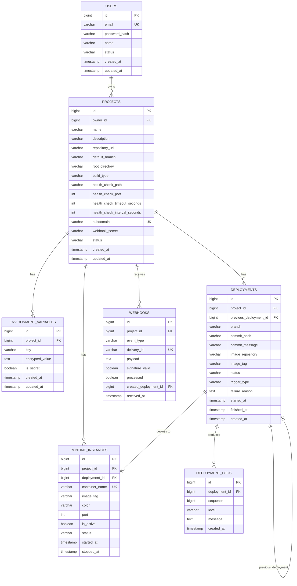

# 03. ERD (Entity Relationship Diagram)

> 1주차 도메인 분석(`01_domain_analysis.md`) §8 도메인 모델을
> 2주차 의사결정(`02_decisions.md`)을 반영하여 ERD로 구체화한 문서.
>
> - 작성자: 김현수
> - 작성일: 2026-06-01
> - 도구: dbdiagram.io / draw.io 호환 mermaid 표기

---

## 1. ERD 개요

### 1.1 엔티티 목록

| # | 엔티티 | 역할 |
|---|---|---|
| 1 | `users` | 플랫폼 사용자 |
| 2 | `projects` | 사용자 GitHub 저장소를 등록한 배포 단위 |
| 3 | `environment_variables` | 프로젝트별 환경변수 (암호화 저장) |
| 4 | `deployments` | 1회의 배포 시도 |
| 5 | `deployment_logs` | 배포 진행 중 적재되는 로그 |
| 6 | `runtime_instances` | 실제로 돌고 있는 컨테이너 (Blue/Green) |
| 7 | `webhooks` | GitHub Webhook 수신 이력 |

### 1.2 전체 ERD (mermaid)



---

## 2. 엔티티 상세

### 2.1 `users`

| 컬럼 | 타입 | 제약 | 비고 |
|---|---|---|---|
| `id` | BIGINT | PK, AUTO_INCREMENT | |
| `email` | VARCHAR(255) | NOT NULL, UNIQUE | 로그인 ID |
| `password_hash` | VARCHAR(255) | NOT NULL | BCrypt |
| `name` | VARCHAR(100) | NOT NULL | |
| `status` | VARCHAR(20) | NOT NULL | `ACTIVE` / `SUSPENDED` / `DELETED` |
| `created_at` | TIMESTAMP | NOT NULL | |
| `updated_at` | TIMESTAMP | NOT NULL | |

**인덱스**
- `idx_users_email` (email) — 로그인 조회

---

### 2.2 `projects`

| 컬럼 | 타입 | 제약 | 비고 |
|---|---|---|---|
| `id` | BIGINT | PK | |
| `owner_id` | BIGINT | FK → users.id, NOT NULL | |
| `name` | VARCHAR(100) | NOT NULL | 사용자가 지은 이름 |
| `description` | VARCHAR(500) | NULL | |
| `repository_url` | VARCHAR(500) | NOT NULL | `https://github.com/...` |
| `default_branch` | VARCHAR(100) | NOT NULL, default `'main'` | |
| `root_directory` | VARCHAR(255) | default `'/'` | Dockerfile 위치 |
| `build_type` | VARCHAR(20) | NOT NULL | MVP는 `DOCKERFILE` 만 |
| `health_check_path` | VARCHAR(200) | default `'/health'` | |
| `health_check_port` | INT | default 8080 | 컨테이너 내부 포트 |
| `health_check_timeout_seconds` | INT | default 60 | |
| `health_check_interval_seconds` | INT | default 5 | |
| `subdomain` | VARCHAR(63) | NOT NULL, UNIQUE | `project-12` 형태, Traefik 라우팅 키 |
| `webhook_secret` | VARCHAR(255) | NOT NULL | Webhook signature 검증용 (암호화) |
| `status` | VARCHAR(20) | NOT NULL | `ACTIVE` / `ARCHIVED` |
| `created_at` | TIMESTAMP | NOT NULL | |
| `updated_at` | TIMESTAMP | NOT NULL | |

**인덱스**
- `idx_projects_owner_id` (owner_id) — 사용자별 프로젝트 목록
- `uk_projects_subdomain` (subdomain) — Traefik 라우팅 유일성

**의사결정 반영**
- `subdomain` 컬럼 추가 — Traefik 라우팅(`project-12.autodeploy.dev`)을 위한 키
- `webhook_secret`은 암호화 저장 (가이드 §3.11)

---

### 2.3 `environment_variables`

| 컬럼 | 타입 | 제약 | 비고 |
|---|---|---|---|
| `id` | BIGINT | PK | |
| `project_id` | BIGINT | FK → projects.id, NOT NULL | |
| `key` | VARCHAR(100) | NOT NULL | |
| `encrypted_value` | TEXT | NOT NULL | AES-GCM 등으로 암호화 |
| `is_secret` | BOOLEAN | NOT NULL, default true | 로그 마스킹 여부 |
| `created_at` | TIMESTAMP | NOT NULL | |
| `updated_at` | TIMESTAMP | NOT NULL | |

**인덱스**
- `uk_env_project_key` (project_id, key) — 프로젝트 내 key 중복 금지

**비고**
- 컨테이너 실행 시 `docker run -e KEY=value` 형태로 주입
- `is_secret=true` 인 항목은 로그에 노출 시 마스킹

---

### 2.4 `deployments`

| 컬럼 | 타입 | 제약 | 비고 |
|---|---|---|---|
| `id` | BIGINT | PK | |
| `project_id` | BIGINT | FK → projects.id, NOT NULL | |
| `previous_deployment_id` | BIGINT | FK → deployments.id, NULL | 직전 성공 배포(롤백 기준) |
| `branch` | VARCHAR(100) | NOT NULL | |
| `commit_hash` | VARCHAR(40) | NOT NULL | |
| `commit_message` | VARCHAR(500) | NULL | |
| `image_repository` | VARCHAR(255) | NOT NULL | MVP: `autodeploy-runtime` |
| `image_tag` | VARCHAR(255) | NOT NULL | `project-12-deploy-101` |
| `status` | VARCHAR(30) | NOT NULL | 상태머신 §04_state_machine.md 참조 |
| `trigger_type` | VARCHAR(20) | NOT NULL | `MANUAL` / `WEBHOOK` / `ROLLBACK` |
| `failure_reason` | TEXT | NULL | FAILED 시 채워짐 |
| `started_at` | TIMESTAMP | NULL | Worker 처리 시작 시점 |
| `finished_at` | TIMESTAMP | NULL | 종료 시점 |
| `created_at` | TIMESTAMP | NOT NULL | 요청 시점 |

**인덱스**
- `idx_deployments_project_created` (project_id, created_at DESC) — 배포 이력 페이지네이션
- `idx_deployments_status` (status) — Worker 모니터링용

**의사결정 반영**
- ECR 미도입(2.2 의사결정) → `image_repository`는 로컬 임의 이름으로 시작, ECR 전환 시 URI로 교체
- Rollback이 Blue-Green 전환과 결합되므로 `previous_deployment_id`는 "직전 성공 배포" 의미로 유지

---

### 2.5 `deployment_logs`

| 컬럼 | 타입 | 제약 | 비고 |
|---|---|---|---|
| `id` | BIGINT | PK | |
| `deployment_id` | BIGINT | FK → deployments.id, NOT NULL | |
| `sequence` | BIGINT | NOT NULL | 배포 내 로그 순서 |
| `level` | VARCHAR(10) | NOT NULL | `INFO` / `WARN` / `ERROR` |
| `message` | TEXT | NOT NULL | |
| `created_at` | TIMESTAMP | NOT NULL | |

**인덱스**
- `idx_logs_deployment_seq` (deployment_id, sequence) — SSE 스트리밍 시 순서 보장 조회

**비고**
- 가이드 §3.9 추천 저장 전략: 최근 로그는 PostgreSQL, 장기 보관은 S3
- MVP에서는 PostgreSQL만 사용 (S3 미도입)
- 로그 적재 시 `is_secret=true` 환경변수 값은 `****` 로 마스킹

---

### 2.6 `runtime_instances` ⭐ Blue-Green 반영

| 컬럼 | 타입 | 제약 | 비고 |
|---|---|---|---|
| `id` | BIGINT | PK | |
| `project_id` | BIGINT | FK → projects.id, NOT NULL | |
| `deployment_id` | BIGINT | FK → deployments.id, NOT NULL | 어떤 배포로 띄운 컨테이너인지 |
| `container_name` | VARCHAR(100) | NOT NULL, UNIQUE | `project-12-blue` / `project-12-green` |
| `image_tag` | VARCHAR(255) | NOT NULL | |
| `color` | VARCHAR(10) | NOT NULL | **`BLUE` / `GREEN`** |
| `port` | INT | NOT NULL | 호스트 포트, 예) 8081 / 8082 |
| `is_active` | BOOLEAN | NOT NULL, default false | **현재 트래픽 받는 쪽** |
| `status` | VARCHAR(20) | NOT NULL | `STARTING` / `RUNNING` / `STOPPED` / `FAILED` |
| `started_at` | TIMESTAMP | NULL | |
| `stopped_at` | TIMESTAMP | NULL | |

**인덱스**
- `uk_runtime_container_name` (container_name) — 컨테이너 이름 유일성
- `idx_runtime_project_active` (project_id, is_active) — 현재 Active 인스턴스 조회

**의사결정 반영 (§2.4 Blue-Green)**
- `color`, `port`, `is_active` 컬럼이 핵심. 이 3개로 Blue-Green 전체 상태가 표현됨
- 프로젝트당 동시에 `BLUE` 1개 + `GREEN` 1개까지 존재 가능
- `is_active=true`는 프로젝트당 최대 1개여야 함 → 애플리케이션 레벨 제약 (DB unique partial index는 MVP에서 생략)
- Traefik 라우팅 변경 = `is_active` 토글 + Traefik label 재설정

**라이프사이클 예시**
```text
초기:
  project-12 → (없음)

deploy-101 (첫 배포):
  project-12-blue   (deploy-101, port 8081, is_active=true)

deploy-102 (두 번째 배포):
  project-12-blue   (deploy-101, port 8081, is_active=true)   ← 기존
  project-12-green  (deploy-102, port 8082, is_active=false)  ← 새 버전 health check 진행 중

→ health check 성공:
  project-12-blue   (deploy-101, port 8081, is_active=false)  ← 트래픽 끊김, 잠시 후 정리
  project-12-green  (deploy-102, port 8082, is_active=true)   ← 트래픽 받음

deploy-103:
  project-12-green  (deploy-102, port 8082, is_active=true)   ← 기존
  project-12-blue   (deploy-103, port 8081, is_active=false)  ← 새 버전 (색만 재활용)
```

---

### 2.7 `webhooks`

| 컬럼 | 타입 | 제약 | 비고 |
|---|---|---|---|
| `id` | BIGINT | PK | |
| `project_id` | BIGINT | FK → projects.id, NOT NULL | |
| `event_type` | VARCHAR(50) | NOT NULL | `push` / `ping` 등 |
| `delivery_id` | VARCHAR(100) | UNIQUE | GitHub `X-GitHub-Delivery` 헤더 |
| `payload` | TEXT | NOT NULL | 원본 JSON (디버그용) |
| `signature_valid` | BOOLEAN | NOT NULL | HMAC 검증 결과 |
| `processed` | BOOLEAN | NOT NULL, default false | Deployment 생성 완료 여부 |
| `created_deployment_id` | BIGINT | FK → deployments.id, NULL | 만들어진 배포 |
| `received_at` | TIMESTAMP | NOT NULL | |

**인덱스**
- `uk_webhooks_delivery_id` (delivery_id) — 중복 수신 방지(GitHub가 재시도하는 경우)

**의사결정 반영 (§2.6 GitHub만)**
- GitLab 관련 필드 없음
- `event_type`은 `push` 위주로 처리, 그 외(`ping` 등)는 200만 반환하고 무시

---

## 3. 인덱스 종합

```sql
-- 로그인
CREATE UNIQUE INDEX idx_users_email ON users(email);

-- 프로젝트 목록
CREATE INDEX idx_projects_owner_id ON projects(owner_id);
CREATE UNIQUE INDEX uk_projects_subdomain ON projects(subdomain);

-- 환경변수 중복 방지
CREATE UNIQUE INDEX uk_env_project_key ON environment_variables(project_id, key);

-- 배포 이력 조회
CREATE INDEX idx_deployments_project_created ON deployments(project_id, created_at DESC);
CREATE INDEX idx_deployments_status ON deployments(status);

-- 로그 스트리밍
CREATE INDEX idx_logs_deployment_seq ON deployment_logs(deployment_id, sequence);

-- 런타임 인스턴스
CREATE UNIQUE INDEX uk_runtime_container_name ON runtime_instances(container_name);
CREATE INDEX idx_runtime_project_active ON runtime_instances(project_id, is_active);

-- 웹훅 중복 수신 방지
CREATE UNIQUE INDEX uk_webhooks_delivery_id ON webhooks(delivery_id);
```

---

## 4. 의도적으로 뺀 것

MVP 범위(§02_decisions.md)에 따라 아래는 ERD에 포함하지 않음.

- **`teams` / `memberships`** — 팀/멀티유저 협업은 MVP 제외
- **`audit_logs`** — 감사 로그는 2차
- **`notifications`** — 알림 발송 이력 별도 테이블은 2차
- **`build_logs` 분리** — Build/Deploy/Runtime 로그를 별도 테이블로 나누지 않고 `deployment_logs` 1개로 통합
- **`oauth_credentials`** — Private repo 지원 시 도입

---

## 5. 다음 단계

이 ERD는 `05_api_spec.md`의 요청/응답 필드와 정합해야 한다.

- `Project` 응답에 `subdomain` 노출
- `Deployment` 응답에 `status`, `previousDeploymentId` 노출
- `Runtime` 조회 응답에 `color`, `port`, `isActive` 노출
- 환경변수 조회 시 `value`는 마스킹(`****`) 또는 미노출
