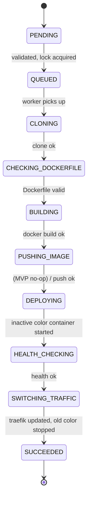
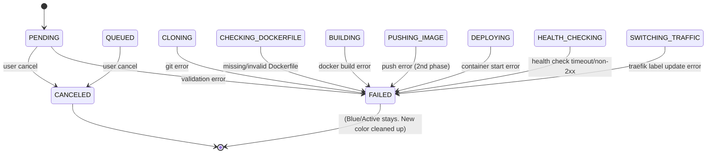
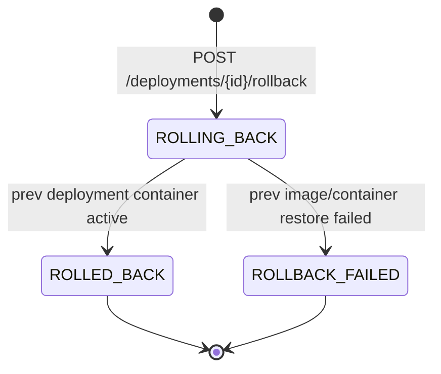
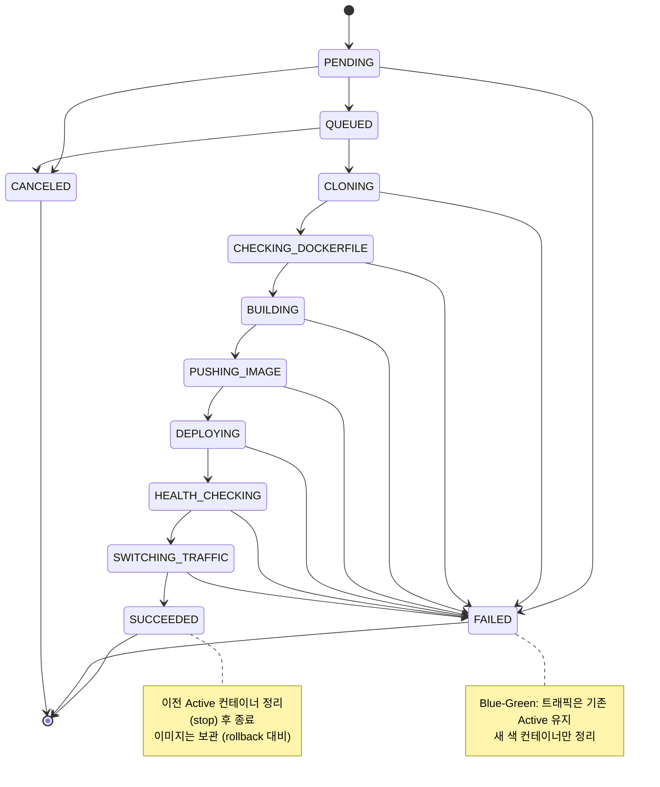

# 04. Deployment 상태머신

> `01_domain_analysis.md` §3.6의 Deployment 상태 정의를
> `02_decisions.md`에서 결정한 **Blue-Green 무중단 배포 + 로컬 Docker MVP** 기준으로 재정의.
>
> - 작성자: 김현수
> - 작성일: 2026-06-01

---

## 1. 개요

- Deployment는 "1회의 배포 시도"이고, 상태(`status`)는 한 번에 하나만 가진다.
- 상태 전이는 **Worker 또는 API Server만** 수행한다. 사용자는 직접 상태를 바꿀 수 없다.
- 상태 변경 시 반드시 `deployment_logs`에 INFO 로그를 함께 적재한다.
- Blue-Green 결정에 따라 `SWITCHING_TRAFFIC` 상태를 추가했다.
- 로컬 Docker MVP에서는 `PUSHING_IMAGE`가 사실상 no-op이지만, 향후 ECR 도입 시 동일 구조를 사용하기 위해 상태는 유지한다.

---

## 2. 상태 정의

| # | 상태 | 의미 | 다음 상태 후보 |
|---|---|---|---|
| 1 | `PENDING` | API가 Deployment 레코드를 만들었지만 아직 검증 전 | `QUEUED`, `FAILED`, `CANCELED` |
| 2 | `QUEUED` | 검증/락 확인 완료, RabbitMQ에 Job 발행됨 | `CLONING`, `CANCELED` |
| 3 | `CLONING` | Worker가 Git clone 진행 중 | `CHECKING_DOCKERFILE`, `FAILED` |
| 4 | `CHECKING_DOCKERFILE` | Dockerfile 존재/유효성 검사 | `BUILDING`, `FAILED` |
| 5 | `BUILDING` | `docker build` 수행 중 | `PUSHING_IMAGE`, `FAILED` |
| 6 | `PUSHING_IMAGE` | (MVP: 로컬이라 no-op, 2차: ECR push) | `DEPLOYING`, `FAILED` |
| 7 | `DEPLOYING` | 비활성 색(Blue/Green) 컨테이너 기동 | `HEALTH_CHECKING`, `FAILED` |
| 8 | `HEALTH_CHECKING` | 새로 띄운 컨테이너 health check 진행 | `SWITCHING_TRAFFIC`, `FAILED` |
| 9 | `SWITCHING_TRAFFIC` ⭐ | Traefik 라우팅을 새 컨테이너로 전환 | `SUCCEEDED`, `FAILED` |
| 10 | `SUCCEEDED` | 트래픽 전환 완료, 이전 색 컨테이너 정리 예정/완료 | (종착) |
| 11 | `FAILED` | 어느 단계든 실패. 트래픽은 **기존 Active** 유지 | `ROLLING_BACK`(수동), (종착) |
| 12 | `CANCELED` | 사용자가 Queue 이전/대기 중에 취소 | (종착) |
| 13 | `ROLLING_BACK` | 사용자가 명시적 rollback 요청 (이전 성공 배포로 되돌림) | `ROLLED_BACK`, `ROLLBACK_FAILED` |
| 14 | `ROLLED_BACK` | 이전 배포의 컨테이너로 트래픽 전환 완료 | (종착) |
| 15 | `ROLLBACK_FAILED` | 이전 이미지/컨테이너 복구 자체가 실패 | (종착, 수동 개입 필요) |

### 2.1 Blue-Green에서의 FAILED 의미 변화 ⚠️

가이드 원본에서는 "FAILED → 이전 이미지로 Rollback"이 명시적 단계였다.
**Blue-Green에서는 트래픽 전환을 안 하면 그것 자체가 즉시 롤백**이다.

```text
[기존 Rollback 방식]
  Blue 정상 → 새 배포가 Blue를 덮어씀 → 실패 시 별도로 이전 이미지 pull/run

[Blue-Green 방식]
  Blue 정상 → Green에 새 배포 → 실패 시 Green만 정리, Blue는 그대로
  → 사용자 입장에서는 무중단, 별도 Rollback 단계 불필요
```

따라서 **자동 Rollback(이전 이미지 자동 복구) 상태는 MVP에서 사용하지 않는다.**
`ROLLING_BACK` 계열은 **사용자가 명시적으로 "이전 성공 배포로 돌아가기"를 요청**했을 때만 사용한다.

---

## 3. 상태 전이 다이어그램

### 3.1 정상 흐름 (Happy Path)



### 3.2 실패 흐름 (Blue-Green: 트래픽은 기존 Active 유지)



> 모든 `FAILED` 진입 시 Worker는 새로 띄운 색(inactive) 컨테이너를 정리한다.
> 기존 Active 컨테이너 / Traefik 라우팅은 **건드리지 않는다.**

### 3.3 명시적 Rollback (사용자 요청)



> Rollback 시작 시: 대상은 "현재 Active deployment". 되돌릴 곳은 그 `previous_deployment_id`.
> Rollback도 내부적으로는 **Blue-Green 전환과 동일**하다. (이전 컨테이너가 살아있으면 트래픽만 돌리고, 죽었으면 다시 띄우고 전환)

### 3.4 통합 (전체)



---

## 4. 상태별 진입/종료 액션 (의사코드)

```text
ENTER PENDING:
    INSERT deployments (status=PENDING)
    LOG "Deployment created"

ENTER QUEUED:
    acquire project deploy lock (Redis)
    publish to deploy.queue
    LOG "Queued"

ENTER CLONING:
    mark started_at
    git clone repository_url to workspace
    LOG "Cloning..."

ENTER CHECKING_DOCKERFILE:
    assert Dockerfile exists at root_directory
    LOG "Dockerfile validated"

ENTER BUILDING:
    docker build -t {image_repository}:{image_tag} workspace
    LOG "Image built: {image_tag}"

ENTER PUSHING_IMAGE:
    if MVP: noop
    else: docker push {ECR_URI}:{image_tag}
    LOG "Image pushed"

ENTER DEPLOYING:
    next_color = opposite of current Active color (or BLUE if first)
    next_port  = 8081 if BLUE else 8082
    docker run with:
      --name project-{id}-{color}
      env from environment_variables
      traefik labels (NOT routing yet — preparation only)
    INSERT runtime_instances (color=next_color, is_active=false, status=STARTING)
    LOG "Container started: {container_name}"

ENTER HEALTH_CHECKING:
    poll http://container:port{health_check_path}
      every health_check_interval_seconds
      up to health_check_timeout_seconds
    LOG each attempt

ENTER SWITCHING_TRAFFIC:
    update traefik label (priority / weight) to route to new container
    set runtime_instances.is_active = true for new container
    set runtime_instances.is_active = false for old container
    LOG "Traffic switched to {new_color}"

ENTER SUCCEEDED:
    mark finished_at
    schedule: stop old container after grace period (e.g. 30s)
    release deploy lock
    LOG "Deployment succeeded"

ENTER FAILED:
    mark finished_at, failure_reason
    docker rm -f new color container (if any)
    DELETE runtime_instances for new color (if any)
    release deploy lock
    LOG "Failed: {reason}"
    (do NOT touch old Active container or traefik)

ENTER CANCELED:
    if message already in queue: ignore at consumer side
    release deploy lock if held
    LOG "Canceled by user"

ENTER ROLLING_BACK:
    target = previous_deployment_id of current Active
    if target container still RUNNING: switch traefik to it
    else: re-run docker run with target.image_tag
    LOG "Rolling back to deploy-{target}"

ENTER ROLLED_BACK:
    release deploy lock
    LOG "Rollback complete"

ENTER ROLLBACK_FAILED:
    release deploy lock
    LOG "Rollback failed - manual intervention required"
    alert
```

---

## 5. 동시성 / Lock 정책

가이드 §3.11에서 언급한 "프로젝트별 배포 lock"을 어떻게 적용하는지 명시.

| 시점 | 락 | 비고 |
|---|---|---|
| `PENDING` 생성 직후 | 시도 | Redis `SETNX deploy:lock:project:{id}` |
| 락 실패 | `FAILED` 또는 큐잉 거절 | "이미 진행 중인 배포가 있습니다" |
| 락 성공 | `QUEUED` | TTL 30분 |
| `SUCCEEDED`/`FAILED`/`CANCELED`/`ROLLED_BACK`/`ROLLBACK_FAILED` | 해제 | 무조건 finally 블록에서 |

---

## 6. enum 정의 (Java)

```java
public enum DeploymentStatus {
    PENDING,
    QUEUED,
    CLONING,
    CHECKING_DOCKERFILE,
    BUILDING,
    PUSHING_IMAGE,
    DEPLOYING,
    HEALTH_CHECKING,
    SWITCHING_TRAFFIC,  // ⭐ Blue-Green
    SUCCEEDED,
    FAILED,
    CANCELED,
    ROLLING_BACK,
    ROLLED_BACK,
    ROLLBACK_FAILED;

    public boolean isTerminal() {
        return this == SUCCEEDED
            || this == FAILED
            || this == CANCELED
            || this == ROLLED_BACK
            || this == ROLLBACK_FAILED;
    }

    public boolean isInProgress() {
        return !isTerminal() && this != PENDING;
    }
}

public enum RuntimeColor {
    BLUE,   // port 8081
    GREEN;  // port 8082

    public RuntimeColor opposite() {
        return this == BLUE ? GREEN : BLUE;
    }

    public int defaultPort() {
        return this == BLUE ? 8081 : 8082;
    }
}

public enum DeploymentTriggerType {
    MANUAL,    // 사용자가 UI에서 버튼 클릭
    WEBHOOK,   // GitHub push 이벤트
    ROLLBACK;  // 명시적 rollback 요청으로 생성된 deployment
}
```

---

## 7. 단위 테스트 시나리오 (가이드 §13 autodeploy-common 반영)

```text
- 정상 전이 통과: PENDING → QUEUED → ... → SUCCEEDED
- 각 단계에서 FAILED 진입 허용
- SUCCEEDED 에서 다른 상태로 전이 시도 → 거부
- FAILED 에서 다른 상태로 전이 시도 → 거부 (단 ROLLING_BACK 은 별도 처리)
- ROLLING_BACK → ROLLED_BACK / ROLLBACK_FAILED 만 허용
- isTerminal() / isInProgress() 정확성
```

---

## 8. 다음 단계

- `05_api_spec.md`의 `POST /deployments/{id}/cancel`, `POST /deployments/{id}/rollback` 동작 정의에 이 상태머신을 그대로 인용
- `06_sequence_diagrams.md`(B 담당) 시퀀스 다이어그램의 각 단계가 이 상태 전이와 1:1 매칭되어야 함
