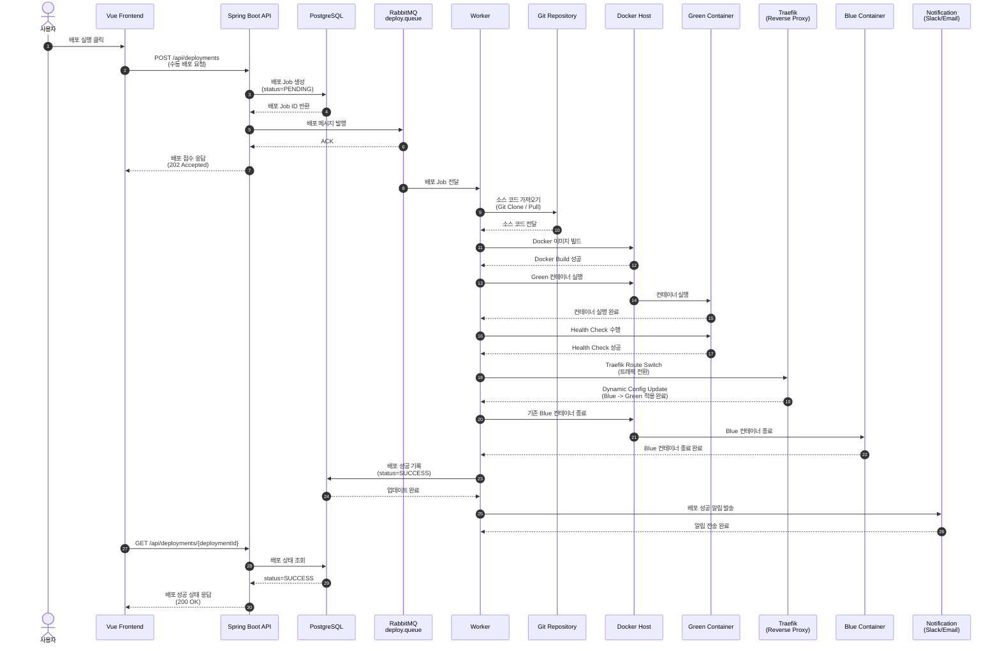
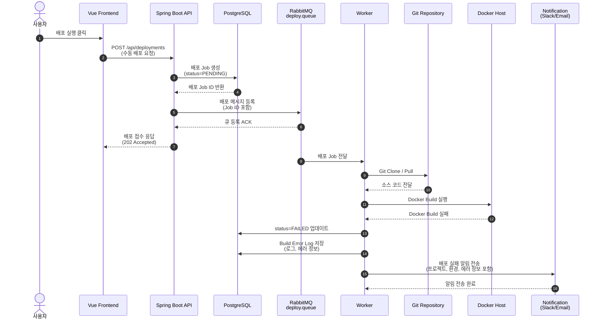
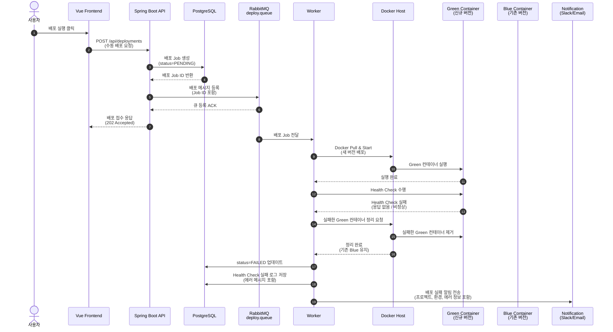
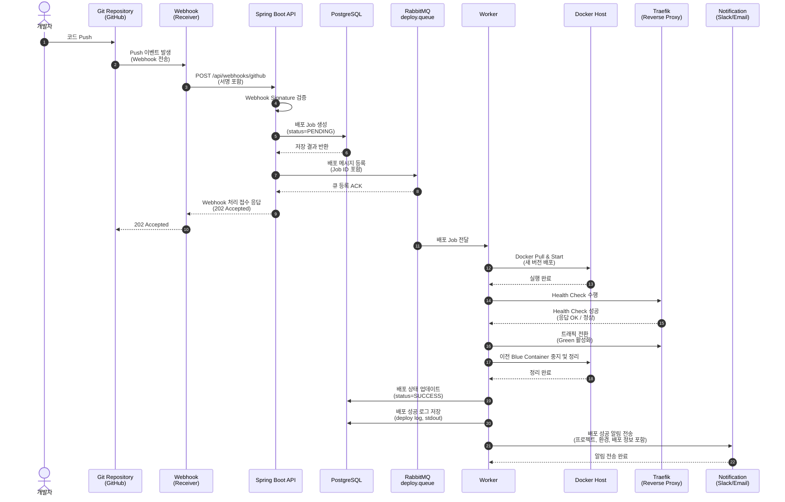

# 06. Sequence Diagrams

### (a) 수동 배포 정상 (Blue -> Green 전환)

---

### (b) 빌드 실패 -> FAILED -> 알림

---

### (c) Health Check 실패 -> 기존 Blue 유지

---

### (d) 코드 Push 후 자동 배포 (GitHub -> Webhook)

---
